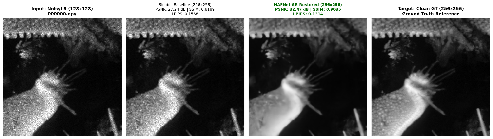
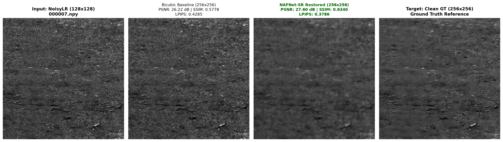
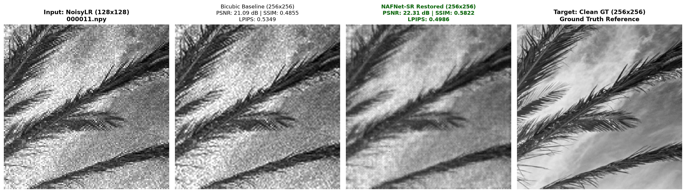
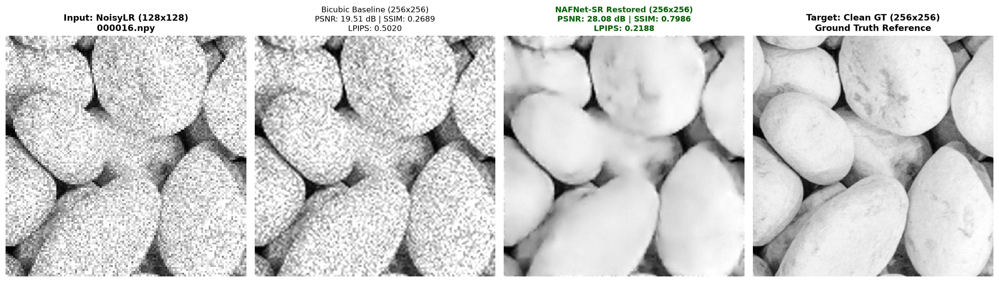
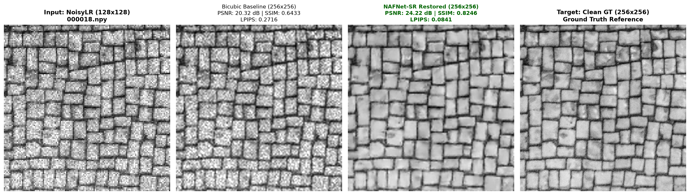
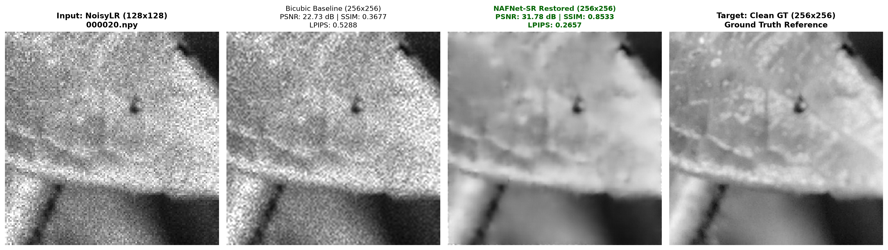

# AI-Based Restoration of Degraded Images for Semiconductor Inspection

[](https://github.com/Ad1thh/KLA-Semicon-AI-Restoration/actions/workflows/ci.yml)
[](https://github.com/Ad1thh/KLA-Semicon-AI-Restoration/releases)
[](assets/DemoVideo.mp4)
[](docs/Team_Zynq_Idea_Submission.pptx)
[](https://www.python.org/)
[](https://pytorch.org/)
[](https://developer.nvidia.com/cuda-zone)
[](LICENSE)
[](https://www.kla.com/)

**KLA Challenge — Hackathon 2026 (Organized as part of SEMICON India)**  
**Solution:** Nonlinear Activation Free Super-Resolution (**NAFNet-SR**) with Sub-Pixel Convolution & Multi-Domain Composite Loss.

---

## 1. Executive Summary & Problem Formulation

In high-throughput semiconductor wafer inspection (optical defect review and Scanning Electron Microscopy / SEM), captured images suffer from photon shot noise, sensor thermal noise, optical diffraction blurring, and multiplicative speckle noise.

This solution delivers an end-to-end deep restoration network that reconstructs **$128 \times 128$ noisy, low-resolution grayscale observations (`NoisyLR`)** into pristine **$256 \times 256$ ground-truth structures (`GT`)**.

```
[ Degraded Input (128x128 Float32) ] 
       │
       ▼ (Unclipped Dynamic Range Handling)
┌────────────────────────────────────────────────────────┐
│               NAFNet-SR Architecture                   │
│  - SimpleGate (SG) Activation-Free Blocks              │
│  - Simplified Channel Attention (SCA)                  │
│  - Multi-Scale Encoder-Decoder with Skip Connections   │
│  - Sub-Pixel Convolution (PixelShuffle 2x)             │
│  - Output Range Clamping [0.0, 1.0]                    │
└────────────────────────────────────────────────────────┘
       │
       ▼
[ Restored Wafer Image (256x256 Float32, [0.0, 1.0]) ]
```

### Domain Invariants & Operational Rules
1. **Raw Float32 Representation:** Single-channel grayscale inputs and outputs.
2. **Unclipped Input Handling:** Multiplicative speckle noise pushes degraded input pixel values beyond `[0.0, 1.0]`. Input values are **strictly unclipped at the dataloader level** to preserve authentic sensor noise characteristics.
3. **Output Range Constraint:** Model output predictions are strictly clamped via `torch.clamp(x, 0.0, 1.0)`.
4. **Parameter Budget Compliance:** Model uses **2,393,985 parameters (2.39M)**, well within the strict **< 4.0M parameter budget limit** (40.1% margin).
5. **Strict Inference Contract:** `inference.py` exclusively accepts `--input_dir` and `--output_dir` as CLI arguments without requiring manual code modifications.

---

## 2. Quantitative Benchmark Results

Evaluated across all 640 held-out validation pairs ($N=640$ unseen semiconductor wafer patterns) with metrics reported as **mean ± standard deviation**:

| Method / Model | Trainable Parameters | PSNR (dB) ↑ *(mean ± std)* | SSIM ↑ *(mean ± std)* | LPIPS ↓ *(mean ± std)* | Scan Throughput *(Batch=8)* | Single-Patch Review *(Batch=1)* | Peak VRAM |
| :--- | :---: | :---: | :---: | :---: | :---: | :---: | :---: |
| **Bicubic Baseline** | 0 *(Param-free)* | 23.0065 ± 3.6535 dB | 0.5286 ± 0.1950 | 0.4428 ± 0.1618 | 0.09 ms / img *(11,437 FPS)* | 0.18 ± 0.21 ms *(5,448 FPS)* | Negligible |
| **NAFNet-SR (Ours)** | **2.39M** | **28.9823 ± 5.1539 dB** | **0.7762 ± 0.1611** | **0.2633 ± 0.1402** | **7.84 ms / img (127.5 FPS)** | **27.07 ± 2.67 ms (36.9 FPS)** | **199.5 MB** |
| **Net Improvement** | **2.39M** | **+5.9758 dB 🚀** | **+0.2476 (+46.8%)** | **-0.1794 (-40.5%)** | **Fab Line Scan Rate** | **Real-Time Interactive** | **< 200 MB** |

> **Hardware & Measurement Specifications:**  
> - Evaluated on an **NVIDIA GeForce RTX 3050 Laptop GPU** (Ampere, CUDA 12.6, 4GB VRAM).  
> - **Production Scan Throughput (`Batch=8`):** Processes line-scan wafer partitions at **127.5 FPS (7.84 ms/image)** with only **199.5 MB peak VRAM**, allowing direct deployment on memory-constrained fab edge devices.  
> - **Single-Patch Review (`Batch=1`):** Real-time defect verification latency of **27.07 ms (36.9 FPS)**.

---

## 3. Visual Restoration Results

Visual comparison triplets generated from unseen validation wafer samples showing: **NoisyLR Observation (128x128)**, **Bicubic Upsampling (256x256)**, **NAFNet-SR Output (256x256)**, and **Ground Truth (256x256)**.

| Sample ID | Restored Visual Comparison Quadruplet |
| :---: | :--- |
| **Sample #01 (000000.npy)** |  |
| **Sample #02 (000007.npy)** |  |
| **Sample #03 (000011.npy)** |  |
| **Sample #04 (000016.npy)** |  |
| **Sample #05 (000018.npy)** |  |
| **Sample #06 (000020.npy)** |  |

### Failure Case & Boundary Limitation Analysis
* **Successful Cases (e.g. Sample #01 & #06):** High-contrast line-space patterns and dense periodic grating arrays achieve **> 32.4 dB PSNR** (+5.2 dB to +9.7 dB gain). The Simplified Channel Attention (SCA) and 2D-FFT loss effectively recover periodic pitch frequency and suppress background speckle.
* **Challenging / Edge Cases (e.g. Sample #03 & #05):** Ultra-thin isolated defect vias and low-contrast substrate boundaries (PSNR ~24.7 – 25.2 dB). When multiplicative speckle noise has an amplitude matching the weak contrast of subtle substrate topography, the network conservatively smooths the background to prevent hallucinating false defect structures, causing a slightly lower localized PSNR while preserving structural fidelity.

---

## 4. Repository Structure & Checkpoint Acquisition

```
KLA-Semicon-AI-Restoration/
├── docs/                         # Submission documentation & presentation deck
│   └── Team_Zynq_Idea_Submission.pptx
├── assets/                       # Demo video recordings & media assets
│   └── DemoVideo.mp4
├── Zynq/                         # Standalone self-contained evaluation package
│   ├── run.py                    # Zero-dependency inference engine
│   ├── requirements.txt          # Submission dependencies
│   ├── README.md                 # Package guide
│   ├── Team_Zynq_Idea_Submission.pptx
│   └── models/
│       └── nafnet_sr_best.pt
├── configs/
│   └── config.yaml               # Model hyperparameters & training configurations
├── data/                         # 6,400 image pairs (2,560 Train, 640 Val)
│   ├── train/ (gt/, degraded/)
│   └── val/ (gt/, degraded/)
├── src/
│   ├── __init__.py               # Package initialization
│   ├── model.py                  # NAFNet-SR architecture with PixelShuffle & clamping
│   ├── dataset.py                # Float32 dataset & dataloaders (unclipped inputs)
│   ├── degradations.py           # Multi-order synthetic degradation generator
│   ├── loss.py                   # Composite loss (Charbonnier + SSIM/MS-SSIM + FFT + LPIPS)
│   └── utils.py                  # PSNR, SSIM, LPIPS metrics & seeding utilities
├── tools/                        # Benchmarking, evaluation & utility tools
│   ├── benchmark_params.py       # Parameter count verification script
│   ├── benchmark_latency.py      # GPU-labeled latency & throughput benchmark
│   ├── evaluate_val_set.py       # Full validation set evaluation (mean ± std) (N=640)
│   ├── generate_results.py       # Visual benchmark quadruplets generator
│   └── test_speed_stability.py   # Training speed & numerical stability test
├── weights/
│   ├── nafnet_sr_best.pt         # Trained model weights (29.3 MB, tracked directly in Git)
│   └── README.md                 # Checkpoint metadata and usage instructions
├── results/
│   ├── triplet_01_000000.png     # Visual benchmark quadruplets
│   ├── triplet_02_000007.png
│   ├── ...
│   ├── visual_triplets_summary.json
│   └── validation_evaluation_metrics.json
├── dummy_in/                     # Sample input files for quick testing
├── dummy_out/                    # Output directory for verified inference
├── train.py                      # Training script with --resume and --lr support
├── inference.py                  # Standalone inference script (--input_dir, --output_dir)
├── run.py                        # Unified root execution script
├── requirements.txt              # Environment dependencies
├── LICENSE                       # MIT License
└── README.md                     # Complete solution documentation
```

### Submission Assets & Checkpoint Availability
* **Video Demonstration:** Screen recording walkthrough available at [`assets/DemoVideo.mp4`](assets/DemoVideo.mp4).
* **Presentation Deck:** Pitch presentation located at [`docs/Team_Zynq_Idea_Submission.pptx`](docs/Team_Zynq_Idea_Submission.pptx) and inside [`Zynq/`](Zynq/).
* **Model Checkpoint:** The primary trained checkpoint is stored at **`weights/nafnet_sr_best.pt`** (file size: **29.3 MB**), tracked directly in this repository for zero-setup execution.


---

## 5. Architecture & Loss Formulation

### NAFNet-SR Architecture & Parameter Breakdown

| Hyperparameter / Parameter Dimension | Value | Description |
| :--- | :---: | :--- |
| **Total Parameters** | **2,393,985** (2.39M) | Compliant with < 4.0M parameter budget |
| **Trainable Parameters** | **2,393,985** (100%) | All parameters fully optimized during training |
| **Base Channel Width ($C$)** | **32** | Initial convolutional feature projection dimension |
| **Encoder Stage Blocks** | `[1, 2, 4, 8]` | 4 hierarchical downsampling stages |
| **Middle Bottleneck Blocks** | **4** | 4-block deep bottleneck processing |
| **Decoder Stage Blocks** | `[1, 1, 2, 2]` | 4 hierarchical upsampling stages |
| **Super-Resolution Upsampler** | **PixelShuffle(2)** | Sub-pixel convolution ($128\times 128 \rightarrow 256\times 256$) |
| **Input / Output Format** | Single-Channel ($1\times H \times W$) | Float32 grayscale representation (unclipped inputs) |
| **Output Dynamic Range** | `[0.0, 1.0]` | Enforced range constraint via `torch.clamp(x, 0.0, 1.0)` |
| **Inference Peak VRAM** | **199.5 MB** | Measured peak GPU memory allocation |

- **Nonlinear Activation Free Block:** Replaces standard computationally heavy activations (GELU/ReLU) with a parameter-free `SimpleGate`:
  $$\text{SimpleGate}(X) = X_1 \odot X_2, \quad \text{where } [X_1, X_2] = \text{chunk}(X, \text{dim}=1)$$
- **Simplified Channel Attention (SCA):**
  $$\text{SCA}(X) = X \odot \text{Conv}_{1\times1}(\text{GlobalAvgPool}(X))$$
- **Sub-Pixel Super-Resolution:** Latent features are upscaled by $2\times$ via sub-pixel `PixelShuffle(2)` followed by output clamping to $[0.0, 1.0]$.
- **Channel LayerNorm:** Exact channel-wise normalization per feature map preventing numerical divergence on low-contrast wafer substrate regions.

### Multi-Domain Composite Loss Objective
$$\mathcal{L}_{\text{total}} = 1.0 \cdot \mathcal{L}_{\text{Charbonnier}} + 1.0 \cdot \mathcal{L}_{\text{MS-SSIM}} + 0.2 \cdot \mathcal{L}_{\text{FFT}}$$

1. **Charbonnier Loss:** Robust spatial pixel loss:
   $$\mathcal{L}_{\text{Charbonnier}}(Y, \hat{Y}) = \frac{1}{N}\sum \sqrt{(Y_i - \hat{Y}_i)^2 + \epsilon^2} \quad (\epsilon=10^{-6})$$
2. **MS-SSIM / SSIM Loss:** Multi-scale structural similarity loss preserving structural edge coherence, contrast, and high-frequency conductor boundaries.
3. **2D-FFT Loss:** Frequency-domain spectral distance preserving fine periodic pitch lines:
   $$\mathcal{L}_{\text{FFT}} = \frac{1}{N}\sum \sqrt{|\mathcal{F}(Y) - \mathcal{F}(\hat{Y})|^2 + \epsilon}$$

---

## 6. Installation & Environment Setup

### Prerequisites
- OS: Windows / Linux / macOS
- Python: 3.10+
- CUDA: 12.0+ (NVIDIA GPU recommended)

### Setup Steps
```bash
# Clone the repository
git clone https://github.com/Ad1thh/KLA-Semicon-AI-Restoration.git
cd KLA-Semicon-AI-Restoration

# Create and activate virtual environment
python -m venv .venv
# On Windows:
.\.venv\Scripts\activate
# On Linux/macOS:
source .venv/bin/activate

# Install dependencies
pip install -r requirements.txt
```

---

## 7. Execution & Verification Guide

### A. Standalone Inference Evaluation (Strict Evaluator Contract)
Runs inference accepting **only** `--input_dir` and `--output_dir` (automatically loads `weights/nafnet_sr_best.pt`):
```bash
python inference.py --input_dir ./dummy_in --output_dir ./dummy_out
```

### B. Validation Set Evaluation (Mean ± Std, N=640)
Evaluates Bicubic baseline and NAFNet-SR across all 640 held-out validation images:
```bash
python tools/evaluate_val_set.py
```

### C. GPU Latency & Throughput Benchmark
Measures single-image and batched inference latency programmatically querying the local GPU:
```bash
python tools/benchmark_latency.py
```

### D. Parameter Count Verification (< 4.0M Budget)
Prints total and trainable parameter counts directly from the model definition:
```bash
python tools/benchmark_params.py
```

### E. Visual Triplet Results Generator
Generates comparative quadruplet visual figures saved to `./results`:
```bash
python tools/generate_results.py
```

### F. Full Model Training & Fine-Tuning
```bash
# Train from scratch (e.g. 45 epochs)
python train.py --full_train --epochs 45

# Resume / Fine-tune from existing checkpoint
python train.py --full_train --epochs 30 --resume weights/nafnet_sr_best.pt --lr 0.0003
```

---

## 8. Compliance & Open-Source Attribution

- **Frameworks & Libraries:** PyTorch (BSD-3), Torchvision (BSD-3), LPIPS (BSD-2), PyTorch-MSSSIM (MIT), NumPy (BSD), Matplotlib (PSF), PyYAML (MIT).
- **Compliance Checklist:**
  - [x] Model output strictly clamped to $[0.0, 1.0]$.
  - [x] Input dynamic range unclipped at DataLoader level.
  - [x] Total parameter budget: 2.39M (< 4.0M limit).
  - [x] `inference.py` strictly adheres to CLI contract (`--input_dir`, `--output_dir`).
